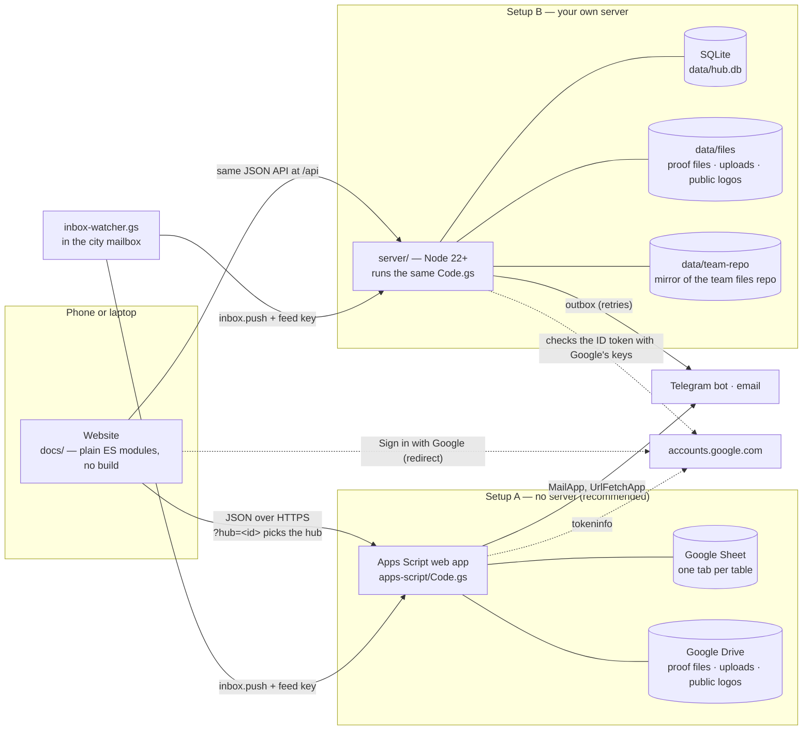

# How Haven Hub works

A guide for anyone who wants to understand, change or run the code. For setting up a hub, read [setup.md](setup.md).

## The parts

| Part | Where | What it is |
|---|---|---|
| **Backend** | [`apps-script/Code.gs`](apps-script/Code.gs) | The whole backend in one paste-able file: the JSON API, permissions, reminders, change alerts, the Telegram bot, email, setup and upgrades. Google Apps Script runs it on a Sheet. |
| **Database** | the Google Sheet (or SQLite) | One tab per table: `Settings`, `People`, `Tasks`, `Log`, `Meetings`, `Rules`, `Milestones`, `Applications`, `Sponsors`, `Resources`, and — created the first time they are needed — `Invites`, `Signups`, `Inbox` (+ `Links` and `Report`, which the hub writes for you). Code reads and writes columns **by header name**, and appends missing columns, so old Sheets upgrade in place. |
| **Website** | [`docs/`](docs/) | Static files served by GitHub Pages — or by the server. `index.html` → `js/main.js` (routing + app shell) → `js/views/*.js` (one file per page). No framework, no build step, no third-party scripts. |
| **Own server** | [`server/`](server/) | Runs the *same* `Code.gs` on Node. `runtime.mjs` implements the Google services it uses (SpreadsheetApp, DriveApp, MailApp…) on SQLite and files, so there is one backend to maintain. Adds what Apps Script can't: a Telegram webhook, an email/Telegram outbox with retries, password and Google sessions, nightly backups, a mirror of your team files repo, `hubctl`. |
| **Demo** | [`docs/demo/`](docs/demo/) | `gas-fakes.js` (in-memory Google services), `demo-data.js` (a made-up team) and a copy of `Code.gs`. `?demo=1` runs the real backend inside the browser; `?demo=1&tour=1` is the guided tour. The tests use the same fakes. |
| **Inbox watcher** | [`apps-script/inbox-watcher.gs`](apps-script/inbox-watcher.gs) | Optional. A separate Apps Script in the city mailbox's own Google account: every 5 minutes it posts new emails (sender, subject, first lines, Gmail link) to `inbox.push` with the **feed key**. The hub never gets Gmail access. |
| **Languages** | [`docs/js/i18n.js`](docs/js/i18n.js) | The words of the public page and the Apply page in each language (`LANGS` in Code.gs lists the codes the backend accepts). The dashboard is English. |
| **Tests** | [`tests/`](tests/) | `node --test tests/*.test.mjs` — the real `Code.gs` against the fakes (`api`, `v45`, `v5`), and the real server over HTTP (`server`, `v45`, `v5`). |

## One request, start to end

1. The browser calls `GET|POST <hub>?action=me&u=<key>&t=<secret>` (Apps Script: `script.google.com/macros/s/<id>/exec`; own server: `/api`).
2. `dispatch_()` in Code.gs looks the action up in the `ACTIONS` table (`level`: public / any / member / lead / admin; `post`: POST only; `lock`: one writer at a time).
3. `person_(t)` finds who is asking from their secret token; the role decides what they may do and see.
4. The action reads/writes rows with `rows_()`, `write_()`, `appendMany_()` (cached per request in `MEMO`), logs to the `Log` tab, and may notify people.
5. JSON goes back. The website keeps the last answer per hub in `localStorage`, so the next visit draws instantly while fresh data loads.

On the server, `app.mjs` runs requests one at a time inside a SQLite transaction (a request that throws is rolled back), then the outbox sends the emails and Telegram messages it queued.

## Who is who: sign-in

| Way | How it works |
|---|---|
| **Single-use invite** (`signin_mode=invite`, the default for new hubs) | `…/?hub=<id>#/invite?k=<40 hex>` — a row in the `Invites` tab (`code, key, created_at, expires_at, used_at, used_how, by`). `invite.check` says who it is for; `invite.claim` uses it up **in one step** with the chosen way: `device` (the browser gets the person's key; on the server an `hs_` session), `google` (binds the Google account), or `password` (own server: makes the account; a failed invite rolls the new account back). A newer invite marks older open ones `replaced`. Messages, reminders and the bot never carry a key in this mode. |
| **Personal link** (`signin_mode=link`, hubs from before v5) | `…/?hub=<id>&u=<key>&t=<32 hex>`. The website stores the key per hub and removes it from the address bar. Reset = a new token; the old link dies. |
| **Password** (own server) | `accounts.mjs`: scrypt hashes, 5 wrong tries = 15-minute lock, sessions `hs_…` stored only as SHA-256. Making a password switches the person's links off. An admin can send a one-time **reset link** (`#/reset?k=…`, 24 h, hash stored). |
| **Google** | `docs/js/google.js` sends the browser to `accounts.google.com` (OpenID Connect, `response_type=id_token`, a random `state` + `nonce`) and reads the ID token from the returned address. The hub then checks it: **Apps Script** asks Google's `tokeninfo`; **the server** checks the RS256 signature against Google's published keys (`server/google.mjs`), plus `iss`, `aud`, `exp` and the single-use nonce. A person matches by their bound Google id, or by the verified email an admin saved in People. Not on the team → a 30-minute ticket that the join form uses (verified name + email). |
| **Guest viewer** | An invite or personal link with the `viewer` role: read-only, no proof, contacts or notes. |
| **Feed key** | `FEED_KEY` script property (`fk_` + 64 hex), made and renewed by admins. Accepted by exactly two public actions, `inbox.push` and `signups.push`; compared by length and value. |

Roles: `viewer` < `member` < `lead` < `admin` (`RANK` in Code.gs). The website only *shows* pages; the backend *enforces* every rule.

## Where things are kept

| Thing | Apps Script hub | Own server |
|---|---|---|
| People, tasks, settings… | Sheet tabs | the same tabs as JSON in SQLite (`sheets` table) |
| Proof photos and files | private Drive folder | `data/files` (private) |
| Uploads on Files | private Drive folder *"… — Team Hub files"*; a `Resources` row with `file`, `mime`, `size`, `preview` (a small data URL); handed out by `file.get` to whoever may see the tile | `data/files` (private), same rows |
| Invites, signup counts, inbox | `Invites`, `Signups`, `Inbox` tabs | same tabs in SQLite |
| Sponsor logos (public) | Drive folder shared *anyone with the link* — or, if the account forbids it, a small data URL in the Sheet | `data/files`, served at `/files/pub/<id>` |
| Profile photos | a small data URL in the `photo` column (≤ 48 000 characters) | same |
| Team files (posters, slides) | a public GitHub repo, listed through GitHub's API | a mirror in `data/team-repo`, served at `/files/raw/<path>` |
| Bot token, group, secrets | Script properties | `props` table, `.env` (chmod 600) |
| Passwords, sessions, reset links | — | `accounts`, `sessions`, `meta` tables (hashes only) |

Exports (`Settings → Export all data`, the weekly email) leave out tokens, chat ids, Google ids and the `Invites` tab.

## Messages

- **Reminders** (`eveningReminders`): every day at the reminder hour — tomorrow's and overdue tasks per person; a team summary for leads.
- **Change alerts** (`tellChanges_` → `sendChanges_`): when a task is added, removed, moved or re-dated, its owner is told and every admin gets one summary saying who was told how. On the server they wait until nobody edited for a minute.
- **Weekly report** (Sunday 19:00), **BLOCKED alerts**, **done alerts with photos**, **group posts**.
- **Group feed** (each switchable): new signup counts (`recordSignups_`), new applications (first name + interest), new files and links (`feedFiles_`, and `feedRepo_` after the server pulls new files from the team repo). New emails go to leads (`inbox_alerts`).
- `notify_(person, message)` picks Telegram or email from the person's choice. Apps Script sends at once; the server queues in the outbox (`outbox.mjs`) with backoff.

## The website

- `main.js`: boot (Google return → `api.resolve()` picks the hub → cached data → load), the `NAV` table (route, roles, feature flag), the shell.
- A page shows only if the role may see it **and** the backend lists the feature (`FEATURES` in Code.gs). That is how one website serves hubs that update at different speeds.
- `ui.js`: escaping, icons, toasts, drawer/modal, forms, dates in the hub's time zone, CSV, avatars with photos, image shrinking (photos and logos are made small in the browser before upload).
- `release.js` belongs to this repo (version, shared site, redirects for hubs that moved); `config.js` is yours if you fork.

## Changing it

1. `python dev/serve.py` → `http://localhost:5178/docs/?demo=1` (add `&as=lead|member|viewer|guest`).
2. Change Code.gs and/or `docs/`. Code.gs must stay one file with no imports, so it can be pasted into Apps Script.
3. `npm run sync` (copies Code.gs into `docs/demo/`), then `npm test`.
4. New tab columns go **at the end** of `TABS`; new settings go in `SETTINGS`; new pages need a `FEATURES` flag.
5. Bump the versions (see [setup.md → For maintainers](setup.md#for-maintainers)) and add a [CHANGELOG](CHANGELOG.md) entry.

Security reports: see [SECURITY.md](SECURITY.md). Contributing: [CONTRIBUTING.md](CONTRIBUTING.md).
