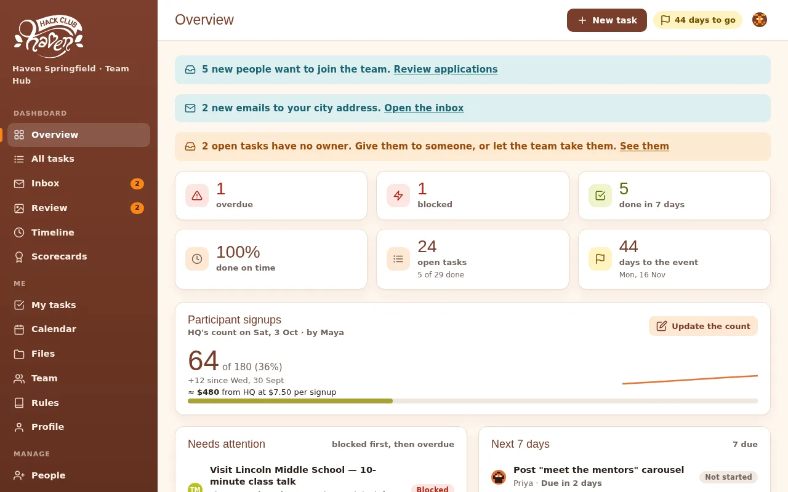

# Haven Hub

**The free team hub for [Hack Club Haven](https://haven.hackclub.com) organizers.** Every organizer gets their own task list, leads get a real dashboard, and your event gets a public page — all running on a Google Sheet you own.

**→ [Take the 2-minute tour](https://notazizelse.github.io/haven-hub/?demo=1&tour=1)** (the real app on a made-up team) · **[What you get](https://notazizelse.github.io/haven-hub/#/about)** · **[Set up your Haven — about 10 minutes](setup.md)** · live example: **[haventash.xyz](https://haventash.xyz)**



| For organizers | For leads & admins | For everyone else |
|---|---|---|
| **My tasks** only: steps, deadline, who to ask — **Start**, **Done + proof**, **I'm blocked** | **Overview**: overdue, blocked, next 7 days, milestones, workload chart, **signup count + funding** | **Public page** in English, Uzbek or Russian: countdown, HQ signup link, sponsors, progress |
| Reminders by Telegram or email the evening before | **All tasks**: filters, bulk edits, CSV import, *update the whole plan* | **Apply page** (three languages) with *Sign up with Google* |
| A message whenever their tasks change | **Review** proof, **Timeline**, **Scorecards** | Read-only **guest links** for HQ, mentors, sponsors |
| **Files**: posters, logos, Canva links, **uploads** — and what each task needs | **Team** + a page per person: job, contacts, work, hours, activity · **Inbox**: new emails to the city address | |
| A **single-use invite**, then Google, a password or just their device | **People** (invites, roles, password reset links), **Applications** (spots people already on the team), **Ambassadors** (students with referral links, QR posters, check-in, a Sunday leaderboard), **Sponsors** (drop a logo), **Settings**, Telegram bot | |

## How it works

- **Backend:** one file, [`apps-script/Code.gs`](apps-script/Code.gs), bound to a Google Sheet and deployed as an Apps Script web app. The Sheet *is* the database. It also sends email and runs an optional team-only Telegram bot.
- **Website:** a static site in [`docs/`](docs/) (plain ES modules, no build step), served by GitHub Pages and **shared by every Haven**. `?hub=<deployment id>` picks the Haven.
- **Or your own server:** [`server/`](server/) runs the *same* `Code.gs` on Node with SQLite — your domain, a Telegram webhook, backups, passwords and Google sign-in. No root or Docker needed.
- **Sign-in:** a single-use invite, then *Sign in with Google*, a password (own server) or just this device — messages never carry a key. Hubs from before v5 can keep personal links. Roles: admin, lead, member, guest viewer — enforced by the backend.
- **Connections (optional):** [`apps-script/inbox-watcher.gs`](apps-script/inbox-watcher.gs) runs in your city mailbox and reports new emails to the Inbox; any script can push the signup count. Both use a feed key that can do nothing else.
- **Languages:** the public and Apply pages speak English, Uzbek and Russian ([`docs/js/i18n.js`](docs/js/i18n.js)); the dashboard is English. More languages are welcome — see [CONTRIBUTING.md](CONTRIBUTING.md).
- **Brand:** colours, fonts and Daven from HQ's [public Haven brand guide](https://www.figma.com/design/V1S8l3ju7K75ABGowht1gj/-PUBLIC--Haven-Brand-Guide).

The full picture — data, sign-in, files, messages, the demo — is in **[ARCHITECTURE.md](ARCHITECTURE.md)**.

## Repo

```
apps-script/Code.gs     the whole backend — paste it into Apps Script
apps-script/inbox-watcher.gs   optional: runs in your city mailbox, reports new emails to the Inbox
docs/                   the website (GitHub Pages: main /docs)
  js/views/             one file per page (landing = the showcase, tour = the guided tour)
  js/i18n.js            the words of the public + Apply pages in each language
  demo/                 the demo: Apps Script fakes, a made-up team, a copy of Code.gs (npm run sync)
  assets/tour/          showcase screenshots (node dev/screenshots.mjs)
server/                 own server: Node + SQLite runtime for Code.gs, Telegram webhook, outbox, Google sign-in, hubctl
tests/                  node --test — the real Code.gs on the fakes, and the real server over HTTP
dev/                    serve.py (local demo), screenshots.mjs
tools/                  sync-demo.mjs
setup.md                the setup guide          ARCHITECTURE.md   how it works inside
CHANGELOG.md            what changed             CONTRIBUTING.md   how to help
```

## Develop

```bash
python dev/serve.py        # then open http://localhost:5178/docs/?demo=1  (&as=admin|lead|member|viewer|guest, or &tour=1)
npm run sync               # after changing Code.gs: copy it into docs/demo/
npm test
```

No dependencies for the website or the tests. The server needs Node 22.13+ (it uses the built-in `node:sqlite`) and `nodemailer` for email.

---

Made by the Haven Tashkent organizers for every Haven. Not an official Hack Club HQ product. [MIT licence](LICENSE) · [Privacy](docs/privacy.html) · [Terms](docs/terms.html).
